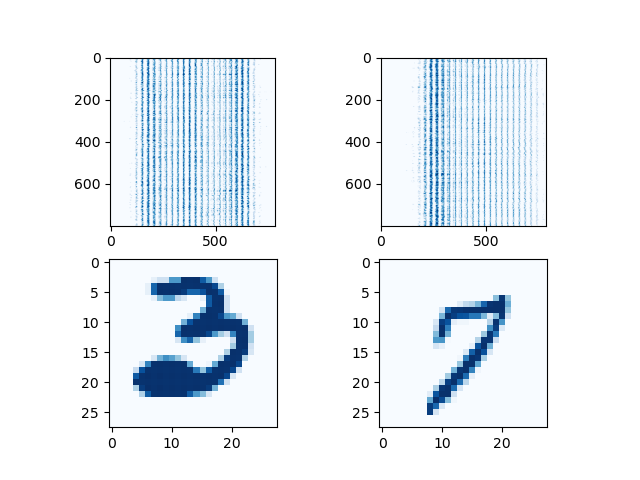
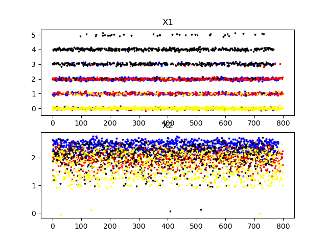
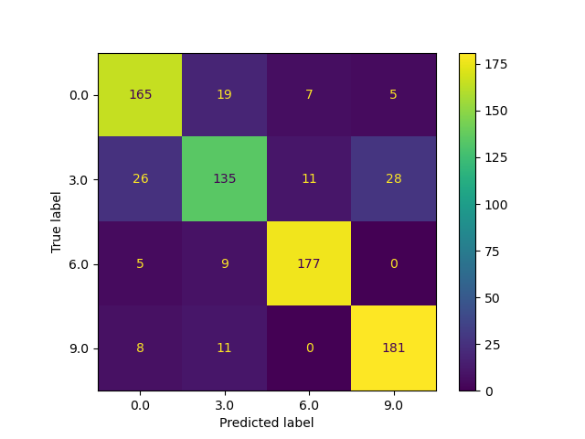
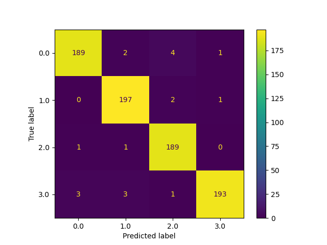

# Pattern recognition (Part 2/4)

#### 👨‍🎓 This project was carried out during my master's degree in computer vision at URJC - Madrid 

The objective of this project is to construct a multi-class classifier.

The goal is to separate MNIST images representing the numbers 0, 3, 6 and 9.

To do so, only two features (extracted from the images or obtained by feature engineering) will be constructed.

And then, optionally, you will be able to increase the dimensionality (by transformations).

These features will then be used to train the classifier.

## Goals

- Construct a linear classifier with only 2 features
- Find the features that will best separate the four types of images
- Have model score >= 0.7

## Requirements

* Python 3.9+


* matplotlib~=3.3.4
* numpy~=1.21.3
* pandas~=1.4.2
* scikit_learn~=1.1.1

How to install all the requirements :

```bash
pip3 install -r requirements.txt
```

## Usage

Execute only from project directory

```bash
python ./src/main.py
```

```bash
python ./src/main_56.py
```

## Structure

    .
    ├── datasets
    │        ├── 1000_cero.csv
    │        ├── 1000_nueve.csv
    │        ├── 1000_seis.csv
    │        ├── 1000_tres.csv
    │        └── reto2_X.csv
    ├── imgs
    │        ├── Figure_1.png
    │        ├── Figure_2.png
    │        ├── Figure_3.png
    │        └── Figure_4.png
    ├── model
    │        └── trained_model.sav
    ├── predictions
    │        └── Reto2_Ypred.csv
    ├── README.md
    ├── requirements.txt
    ├── Reto2_2021.pdf
    └── src
        ├── main.py
        ├── main_56.py
        └── visualization.py

## Examples

These are some examples of the MNIST database



These are the 2 features selected



These are some results of the model (with 2 features) (score = 0.8361)



These are others results of the model (with 56 features) (score = 0.98)



## Authors

* **Luis Rosario** - *Member 1* - [Luisrosario2604](https://github.com/Luisrosario2604)
* **Vicent Gilabert Maño** - *Member 2* - [Vicent](https://github.com/vgilabert94)
